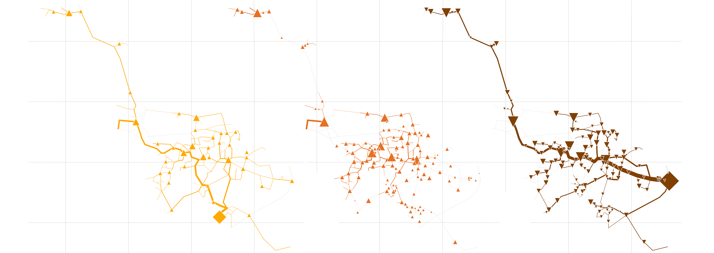

# FlexiGIS-Grid

The FlexiGIS-Grid scripts aim to perform a soft-coupling of the energy system models [**rivus**](https://github.com/tum-ens/rivus)
and the QGIS-Plugin of [**FlexiGIS**](https://github.com/FlexiGIS/FlexiGIS-plugin) is performed. 

**rivus** is a [mixed integer linear programming](https://en.wikipedia.org/wiki/Integer_programming) optimisation model 
for capacity planning of energy infrastructure networks. Its name, latin for stream or canal, stems from its origin as a 
companion model for [urbs](https://github.com/tum-ens/urbs), an optimisation model for urban energy systems. The model 
has been first published in the dissertation of [Johannes Dorfner](https://github.com/ojdo) ["Open Source Modelling 
and Optimisation of Energy Infrastructure at Urban Scale"](http://nbn-resolving.de/urn/resolver.pl?urn:nbn:de:bvb:91-diss-20161206-1285570-1-6).

**FlexiGIS-plugin** is a graphical user interface (GUI) of the FlexiGIS-model. It extracts the 
geo-datasets of the urban energy infrastructure and simulates the electricity consumption in the respective case study. 
This plugin can be directly installed from the QGIS Plugin Manager within the QGIS Desktop.

---
## Features:

  * **rivus** finds the minimum cost energy infrastructure networks to satisfy a given energy distribution for possibly multiple 
    commodities (e.g. electricity, heating, cooling, ...).
  * Tests have been performed on municipal districts.
  * Functionality of **rivus** as been coupled with Geoprocessing module of **FlexiGIS** to generate grids of any region  
    
    
  * Time is represented by a (small) set of weighted time steps that represent peak or typical loads. Both demands and technical 
    parameters can be edited in a spreadsheet.
  * Spatial input data is provided in form of shapefiles.
  * **rivus** itself is written using [Pyomo](https://software.sandia.gov/trac/coopr/wiki/Pyomo) and includes reporting 
    and plotting functionality. For more details use the [official documentation](http://rivus.readthedocs.io/en/latest/).

## Installation:
1. Download FlexiGIS-Grid, rivus and Skeletron package to desired working directory
```
(base)$ git clone https://github.com/FlexiGIS/FlexiGIS-Grid.git
(base)$ git clone https://github.com/FlexiGIS/rivus.git
(base)$ git clone https://github.com/ojdo/Skeletron.git
```
2. Set up conda virtual environment and install Skeletron package via pip 
```
(base)$ cd FlexiGIS-Grid
(base)$ conda env create -f environment.yml
(base)$ conda activate flexigisgrid
(flexigisgrid)$ pip install -e ../Skeletron
```
3. Copy rivus package into FlexiGIS-Grid directory
```
(flexigisgrid)$ cp -r ../rivus/rivus .
```
---
## Workflow:

The coupling of both tools was guided by a three step workflow (see Fig. 1). Network optimization in rivus requires
spatial and non-spatial input data. Non-spatial data contained in **data**.xlsx has been mainly adapted from the example 
provided in the original publication. 

> - **Input**:
> POLY-file from region of interest, 
> OSM-Protobuffer-File containing region, 
> location of substations/gas terminals
> - **Output**: cost-optimized multi-commodity energy infrastructure networks


Fig. 1: Workflow describing the general order processing steps from pbf-files to rivus-plots. (Alhamwi et al., 2021) 

### 1. Geoprocessing with FlexiGIS:

Spatial data is processed using **FlexiGIS**. Download a super-regional data set (as an exchange for _niedersachsen-latest_.osm.pbf) 
from a provider like GeoFabrik.  Generate a POLY-File containing the shape of the region/district you are interested in. In Fig. 1,  with 

Open QGIS3-Desktop and launch the FlexiGIS-Plugin. 

**I- Extract urban datasets**: Load the super-regional data set, as well as the POLY-file 
so that FlexiGIS can generate the urban-infrastructure for the region of interest. For better 
maintainability, store the output under the POLY-files name (e.g. district name)

**II- Geoprocessing urban datasets**: Open the previously extracted dataset. Under *"Select urban element (OSM key)"*
you then select *"building"* and *"highway"*. This will generate csv-files that are referenced in Fig. 2. 

> **Note**: The FlexiGIS module generates the unfiltered data sets, as well as the filtered ones. Please copy agricultural.csv, 
commercial.csv, educational.csv, industrial.csv, residential.csv, highway_lines.csv and highway_squares.csv to the folder 
*data/flexigis-input/fg-wechloy-raw*. You may want to adjust the directory's name to suit your districts name.

To complete the pre-processing, follow the workflow presented in Fig. 2. It might be necessary to first adjust your input
(and output) directories to account for the location of your files. 
 
> **Note**: The location of sources required for *sources.csv* is approximated as the vertex which lies closest to the 
> actual substation or gas terminal. The capacity given is simply an upper limit in kW. 
> 
> To approximate the location use QGIS and open the network of edge.shp and vertex.shp. Activate vertex-labels and load
> the location of substations etc. 

### 2. Network optimization with rivus:

Open **runwechloy**.py. Change the *base_directory* to your input directory (i.e. where *edge_w_demands*.shp and 
*vertex_w_source*.shp lie). The results will be generated within this folder.

In line 33 under *scenarios* choose one (or a set) of scenarios, that should be run for you.


Fig. 2: Follow this workflow to convert FlexiGIS-processed **wechloy**.osm.pbf to rivus-compatible edge.shp and vertex.shp. 
This workflow defines conversion indicated through arrows in Fig. 1 at the border of Step 1 and Step 2. (Alhamwi et al., 2021)

### 3. Results:

The *rivus* package provides two different output types. Maps of peak demand and maximum transported power per edge are 
plotted and saved many different configurations. It is possible to plot with buildings as well.

A detailed overview on utilization and positioning of conversion processes, as well as extensive information on line
utilization is provided in **report**.xlsx.


Fig. 3: Diagram shows grids that are generated for maximum transported power. Orange (Electricity), Red (Heat) and Brown
(Gas). (Dorfner, 2015)

---
## License

FlexiGIS-Grid is licensed under the [BSD-3-Clause](https://opensource.org/licenses/BSD-3-Clause), "New BSD License" or "Modified BSD License".

Please see the file [LICENSE.md](LICENSE.md) for further information about how the content is licensed.

Furthermore, the OpenStreetMap (OSM) data are available under the Open Database License (ODbL). A description of the ODbL license is available [here](http://opendatacommons.org/licenses/odbl). OpenStreetMap cartography is licensed as CC BY-SA. For more information on the copyright of OpenStreetMap please visit [here](http://www.openstreetmap.org/copyright).

## Contact

Authors:
* Alaa Alhamwi alaa.alhamwi@dlr.de 
* Hauke Bents hauke.bents@dlr.de
* Wided Medjroubi wided.medjroubi@dlr.de

Organisation: German Aerospace Center - DLR Institute of Networked Energy Systems

## References
[1] A. Alhamwi, H. Bents and W. Medjroubi, "Open Source Tool for the Analysis and Simulation of Urban Energy Infrastructures",
_2022 Open Source Modelling and Simulation of Energy Systems (OSMSES)_, 2022, pp. 1-6, 
doi: [10.1109/OSMSES54027.2022.9769155](https://doi.org/10.1109/OSMSES54027.2022.9769155)

[2] J. Dorfner, "Open Source Modelling and Optimisation of Energy Infrastructure at Urban Scale", Dissertation, 
Department of Electrical Engineering, Technical University of Munich, Munich, 2016. [Online]. 
Available: [https://mediatum.ub.tum.de/?id=1285570](https://mediatum.ub.tum.de/?id=1285570)
